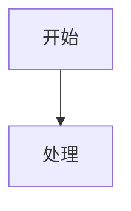

# AI 文档生成

## 核心理念

使用**单文件 HTML** 作为统一载体：

1. **Markdown 内容体**：`<script type="text/markdown">` 承载纯 Markdown，放在文件最前面（第 4 行起），打开即可阅读正文
2. **marked.js 运行时渲染**：浏览器端 Markdown → HTML，AI 只需输出 Markdown（AI 最擅长的格式）
3. **Mermaid + Prism.js**：Markdown 围栏代码块原生支持图表渲染与代码高亮

输出物为 **一个独立 .html 文件**，零依赖（CDN）、Git 友好、浏览器原生预览、可一键导出 PDF。

**为什么选择此技术？**

| 优势 | 说明 |
|---|---|
| **AI 天然擅长** | Markdown 是 AI 产出最稳定、最不易出错的格式 |
| **内容优先** | Markdown 在文件最前面，人与 AI 都从第 5 行开始阅读 |
| **体积小巧** | 300–500 行（含完整内容），传统 HTML 方案需 800–1500 行 |
| **内联 CSS** | 最小化压缩 `<style>` 块（~53 行），离线可用、零外部 CSS 请求 |
| **图表自由** | ` ```mermaid ``` ` 代码块原生支持全部 Mermaid 图表类型 |

## 何时使用本 Skill

触发场景：
- 用户要求生成技术方案 / 架构设计 / 博客 / 教程 / 产品需求 / API / 测试报告等富文档
- 涉及架构图、流程图、时序图等图表
- 需要嵌入代码块（多语言、语法高亮）
- 用户提到类似表述："美观的文档"、"图文并茂的文档"、"浏览器可直接打开的文档"、"替代 Markdown 的富文档"、"AI 文档"、"单文件 HTML"、"ai_doc"、"Markdown 渲染"、"HTML 渲染"

## 使用流程

### 第一步：创建 HTML

参考 [example.html](example.html)（约 493 行，含完整 Markdown 内容）的骨架：

**文件结构**（Markdown 内容优先，可直接阅读）：

```
第 1–3 行：  <!DOCTYPE html> / <html> / <head>
第 4 行：    <script type="text/markdown" id="md-source">
第 5–N 行：  纯 Markdown 内容（文章正文）
第 N+1 行：  </script>
第 N+2–末尾：<meta> + CDN + <style> + </head> + <body> + <nav> + <main> + <footer> + 渲染脚本
```

**关键设计**：Markdown 内容放在文件最前面（`<head>` 内第 4 行起），打开文件即可看到正文，无需滚动翻阅 HTML 基础设施代码。

### 第二步：编写 Markdown 内容

在 `<script type="text/markdown">` 块内编写纯 Markdown，以下特殊内容需特别注意：

**架构图**：使用 ` ```mermaid graph TD/LR ` 展示系统拓扑、服务交互、分层架构。节点用方括号 `A[名称]`，中文节点必须加引号 `A["中文"]`，配色用 `classDef` + `class`。如需严格等宽分层（≥3 层级），改用内联 HTML `<div class="flex">` + `<div class="flex-1">` 实现像素级对齐——参见 [example.html](example.html) 第 259 行「订单管理后台」原型。

**流程图**：使用 ` ```mermaid flowchart TD ` + 菱形 `{判断}` 表达决策分支，`-->|是/否|` 标注分支条件。多条回流用 `Adjust --> Check` 回到上游节点。

**界面原型**（重要）：**HTML 渲染方案可以在 Markdown 中直接写内联 HTML**。用 `<div class="flex">`、`<table>`、`<input>`、`<button>` 等构建可交互的管理后台、表单、列表页原型。CSS 内联样式已在 `<style>` 块中就绪（边框、圆角、悬停、表格、卡片等），无需额外 Tailwind class。参见 [example.html](example.html) 第 259–299 行的「订单管理后台原型」。

**代码块**：使用 ` ```js / ```python / ```bash / ```json / ```html ` 等围栏语法，语言名需与 Prism 组件名一致。默认已加载 js / python / bash / json / markup，其他语言需在 `<head>` 追加 `<script src="prism-{lang}.min.js">`。

**其他**：标题、列表、引用（`>`）、表格、图片、折叠块（`<details>`）、键盘按键（`<kbd>`）、高亮文字（`<mark>`）等标准 Markdown + 内联 HTML，内联 CSS 已全覆盖。

### 第三步：渲染与交互

保留以下核心脚本：
- **marked.js 自定义 renderer**：处理 Mermaid 代码块（`lang === 'mermaid'` → `<pre class="mermaid">`）、代码高亮（HTML 转义后包装为 `<pre class="language-xxx">`）
- **Mermaid 异步渲染**：`mermaid.run()` 在 DOM 插入后执行
- **Prism.js 后处理**：`Prism.highlightAll()` 延迟 500ms 执行
- **`exportToPDF()`**：`window.print()` + `@media print` CSS
- **`<script>` 内容转义**：`textContent` 读取前做 `<\/script` → `<\\/script` 替换，防止提前截断

## 构建模块速查

### 1. HTML 渲染模板骨架

```html
<!DOCTYPE html>
<html lang="zh-CN">
<head>
<script type="text/markdown" id="md-source">
# 文档标题

## 一、章节标题

正文内容…支持 **粗体**、*斜体*、`行内代码`。

> 引用块：关键要点提示

- 列表项 1
- 列表项 2



```python
def hello():
    print("Hello")
```

| 列1 | 列2 |
|-----|-----|
| 值  | 值  |
</script>
<meta charset="UTF-8">
<meta name="viewport" content="width=device-width, initial-scale=1.0">
<title>文档标题</title>
<!-- CDN：marked.js + Mermaid + Prism.js + Tailwind -->
<script src="https://cdn.tailwindcss.com"></script>
<script src="https://cdn.jsdelivr.net/npm/marked@15/marked.min.js"></script>
<script src="https://cdn.jsdelivr.net/npm/mermaid@11/dist/mermaid.min.js"></script>
<link href="https://cdn.jsdelivr.net/npm/prismjs@1.29.0/themes/prism-tomorrow.min.css" rel="stylesheet">
<script src="https://cdn.jsdelivr.net/npm/prismjs@1.29.0/prism.min.js"></script>
<!-- 按需引入 Prism 语言组件 -->
<style>/* 内联最小化 CSS（完整参考 example.html） */</style>
</head>
<body class="bg-gray-50 font-sans">
<nav><!-- 导航栏 --></nav>
<main><div id="content" class="bg-white rounded-xl shadow-sm p-6 sm:p-8"></div></main>
<footer><!-- 页脚 --></footer>
<script>
// marked.js + Mermaid 渲染脚本（见 reference.md）
</script>
</body>
</html>
```

### 2. 渲染脚本

```javascript
(function(){
  const src = document.getElementById('md-source');
  let md = src.textContent;
  // 防止 Markdown 中的 </script> 提前截断 HTML
  md = md.replace(/<\/script/gi, '<\\/script');
  
  marked.setOptions({ breaks: true, gfm: true });
  
  const renderer = new marked.Renderer();
  renderer.code = function(token) {
    const code = typeof token === 'string' ? token : (token.text || token.raw || '');
    const lang = typeof token === 'string' ? '' : (token.lang || '');
    // Mermaid 特殊处理
    if (lang === 'mermaid') {
      return `<div class="mermaid-wrapper my-4 p-4 bg-gray-50 border rounded-lg">
        <pre class="mermaid">${code}</pre></div>`;
    }
    // 代码块 HTML 转义
    const safe = code.replace(/<\\\/script/gi, '<\/script')
      .replace(/&/g, '&amp;').replace(/</g, '&lt;')
      .replace(/>/g, '&gt;');
    return `<pre class="language-${lang || 'plaintext'}"><code class="language-${lang || 'plaintext'}">${safe}</code></pre>`;
  };
  
  document.getElementById('content').innerHTML = marked.parse(md, { renderer });
  
  // Mermaid 异步渲染
  mermaid.initialize({ startOnLoad: false, theme: 'neutral' });
  setTimeout(() => {
    document.querySelectorAll('.mermaid-wrapper .mermaid').forEach(el => {
      if (el.textContent.trim()) mermaid.run({ nodes: [el] });
    });
  }, 200);
  
  // Prism 异步高亮
  setTimeout(() => { window.Prism && Prism.highlightAll(); }, 500);
})();
```

### 3. Markdown 内容编写规范

- **Mermaid 图表**：` ```mermaid ``` ` 代码块（renderer 自动识别 `lang === 'mermaid'`）
- **代码块**：` ```js / ```python / ```bash ``` ` 等（标准 Markdown 围栏语法）
- **`</script>` 冲突**：Markdown 内容中避免直接出现 `</script>`；若必须出现，写为 `<\/script>`（`\` 在 HTML 中为字面量，渲染脚本会处理）
- **HTML 标签**：Markdown 中可直接使用 HTML 标签（如 `<details>`、`<kbd>`、`<mark>`），内联 CSS 已覆盖所有常用元素

## 内容编写规范

1. **Markdown 放在文件最前面**：`<script type="text/markdown">` 紧跟 `<head>` 之后（第 4 行），内容从第 5 行开始
2. **章节编号**：使用 `## 一、章节标题`（Markdown H2）+ `### 1.1 子标题`（H3）
3. **Mermaid**：` ```mermaid ``` ` 代码块，与普通代码块并列
4. **引用块**：使用 `> 摘要内容` 语法
5. **代码块**：标准围栏语法 ` ```lang ``` `，语言名与 Prism 组件名一致（js/python/bash/json/sql）
6. **表格**：标准 Markdown 表格语法
7. **图片**：`` 或 ``
8. **折叠块**：`<details><summary>标题</summary>内容</details>`（直接写 HTML）

## 输出要求

- 必须输出**完整单文件 HTML**，可直接保存为 `.html` 双击打开
- **Markdown 内容放在文件最前面**：`<script type="text/markdown" id="md-source">` 紧跟 `<head>` 之后
- 保留所有核心 CDN：Tailwind v4、marked.js v15、Mermaid v11、Prism 1.29
- 保留 `marked.js` 自定义 renderer（Mermaid + 代码高亮处理）
- 保留 `<script>` 内容转义逻辑（`<\/script` 替换）
- 保留 `exportToPDF` 函数和 `@media print` CSS
- CSS 使用内联最小化版 `<style>` 块（参考 [example.html](example.html) 第 377–428 行），覆盖 Markdown 所有生成元素
- 不引用任何本地资源
- 占位图统一使用 `https://picsum.photos/`

## 常见错误规避

| 错误 | 后果 | 规避 |
|---|---|---|
| Markdown 内容中出现 `</script>` | HTML 被提前截断 | 写为 `<\/script>` 或由渲染脚本处理 |
| Mermaid 代码块未用自定义 renderer | 被 Prism 当作普通代码高亮 | renderer 中判断 `lang === 'mermaid'` |
| `Prism.highlightAll()` 在 Mermaid 之前执行 | Mermaid 图表被 Prism 错误处理 | Prism 延迟到 500ms 之后执行 |
| 删除 `@media print` CSS | PDF 导出排版混乱 | 永远保留 |

## 相关文件

- [example.html](example.html) — 完整模板（约 493 行，含内联 CSS + Markdown 内容 + 渲染脚本）
- [reference.md](reference.md) — 进阶参考（架构细节、Mermaid 进阶、渲染器详解、内容规范）
- [examples.md](examples.md) — 常见调用场景与提示词样例
