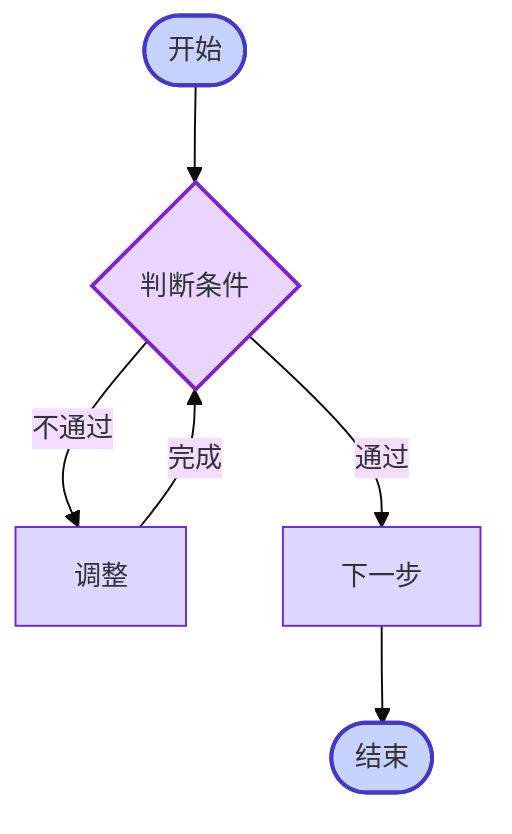
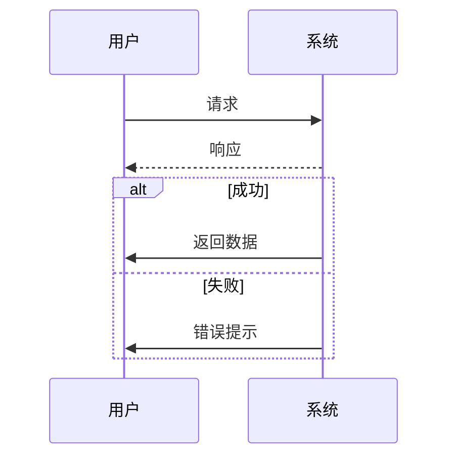
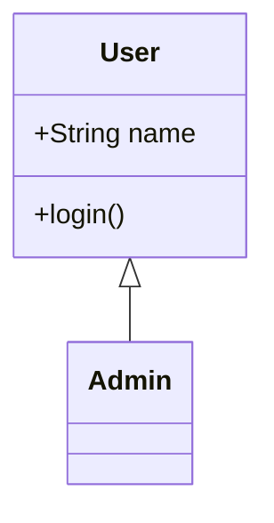
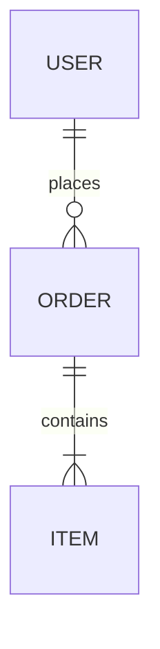
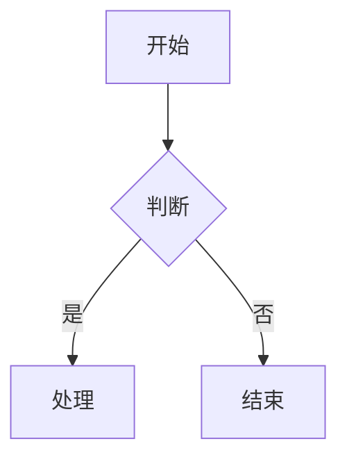

# AI 文档进阶参考

本文件提供 SKILL.md 中提到但需要更多细节的复杂场景参考。智能体在生成时按需查阅本文件即可，无需把所有细节都装入主指令。

---

## 1. 架构详解

> **使用场景**：博客文章、教程文档、内容密集文档、快速 AI 生成场景。

### 1.1 文件结构（内容优先）

```
行 1:    <!DOCTYPE html>
行 2:    <html lang="zh-CN">
行 3:    <head>
行 4:    <script type="text/markdown" id="md-source">
行 5–N:   ← 纯 Markdown 内容，从第 5 行开始，打开即可阅读
          # 标题
          ## 章节
          正文…
          ```mermaid
          graph TD ...
          ```
          ```js
          code...
          ```
行 N+1:  </script>
行 N+2:  <meta charset="UTF-8"> ← CDN / <style> / </head> / <body> / 渲染脚本
```

**设计意图**：Markdown 内容放在最前面，人与 AI 都能直接从第 5 行开始阅读，无需翻阅基础设施代码。

### 1.2 CDN 依赖

| CDN | 用途 | 版本 |
|---|---|---|
| `marked.js` | Markdown → HTML 运行时渲染 | v15 |
| `mermaid` | 图表渲染 | v11 |
| `prism.js` + 主题 + 语言组件 | 代码语法高亮 | v1.29 |
| `tailwindcss` | 页面框架布局（非内容样式） | v4 CDN |

### 1.3 渲染器核心逻辑

```javascript
// 1. 读取 Markdown 源码
const src = document.getElementById('md-source');
let md = src.textContent;
// 安全处理：防止 </script> 截断
md = md.replace(/<\/script/gi, '<\\/script');

// 2. 配置 marked.js
marked.setOptions({ breaks: true, gfm: true });

// 3. 自定义 renderer：区分 Mermaid 与普通代码块
const renderer = new marked.Renderer();
renderer.code = function(token) {
  const code = typeof token === 'string' ? token : (token.text || token.raw || '');
  const lang = typeof token === 'string' ? '' : (token.lang || '');
  
  if (lang === 'mermaid') {
    return `<div class="mermaid-wrapper my-4 p-4 bg-gray-50 border rounded-lg">
      <pre class="mermaid">${code}</pre></div>`;
  }
  
  // 普通代码块：HTML 转义
  const safe = code
    .replace(/<\\\/script/gi, '<\/script')
    .replace(/&/g, '&amp;').replace(/</g, '&lt;')
    .replace(/>/g, '&gt;');
  return `<pre class="language-${lang || 'plaintext'}"><code class="language-${lang || 'plaintext'}">${safe}</code></pre>`;
};

// 4. 渲染到 DOM
document.getElementById('content').innerHTML = marked.parse(md, { renderer });

// 5. 异步渲染 Mermaid（200ms 延迟等待 DOM 就绪）
mermaid.initialize({ startOnLoad: false, theme: 'neutral' });
setTimeout(() => {
  document.querySelectorAll('.mermaid-wrapper .mermaid').forEach(el => {
    if (el.textContent.trim()) mermaid.run({ nodes: [el] });
  });
}, 200);

// 6. 异步高亮代码（500ms 确保 Mermaid 已完成）
setTimeout(() => { window.Prism && Prism.highlightAll(); }, 500);
```

### 1.4 执行时序

```
页面加载
  ↓
读取 <script type="text/markdown"> 内容
  ↓              ↓
</script> 转义   标记配置
  ↓              ↓
marked.parse() ← 自定义 renderer
  ↓
innerHTML 写入 DOM
  ↓
┌─────────────┬──────────────┐
│ 200ms 后    │ 500ms 后     │
│ mermaid.run │ Prism.highlightAll │
│ (图表渲染)   │ (代码高亮)    │
└─────────────┴──────────────┘
```

**关键**：500ms 延迟确保 Mermaid SVG 已插入 DOM，Prism 不会误处理 Mermaid 代码块。

---

## 2. Mermaid 图表进阶

### 2.1 流程图（含判断分支与回流）



**节点形状对照**：

| 形状 | 语法 | 用途 |
|---|---|---|
| 矩形 | `[文本]` | 普通处理步骤 |
| 圆角矩形 | `(文本)` | 子流程 |
| 胶囊 | `([文本])` | 开始/结束 |
| 菱形 | `{文本}` | 判断决策 |
| 圆柱 | `[(文本)]` | 数据库/存储 |
| 平行四边形 | `[/文本/]` | 输入/输出 |

### 2.2 时序图



### 2.3 类图与 ER 图





### 2.4 主题与字体调整

在图表第一行加入：

```
%%{init: {'theme':'base','themeVariables':{'fontSize':'14px','primaryColor':'#dbeafe'}}}%%
```

可选 theme：`default` / `neutral` / `dark` / `forest` / `base`。

### 2.5 Markdown 中嵌入 Mermaid 注意事项

- 使用 ` ```mermaid ``` ` 围栏代码块（不是 ` ```mermaid ` 加空格）
- 每行缩进不要超出 Mermaid 语法规范（顶格写最安全）
- 中文节点名需要用引号包裹：`A["节点名称"]`
- 不要在 Mermaid 块中使用 Markdown 语法（如 `**粗体**`）

---

## 3. Prism.js 代码高亮扩展

### 3.1 已默认引入语言

js / ts / python / java / bash / json / sql / yaml

### 3.2 扩展更多语言

在 head 已有 Prism 引用之后追加：

```html
<script src="https://cdn.jsdelivr.net/npm/prismjs@1.29.0/components/prism-{lang}.min.js"></script>
```

常用语言名：`go`、`rust`、`csharp`、`kotlin`、`swift`、`docker`、`nginx`、`graphql`、`markdown`、`xml`、`scss`、`tsx`、`jsx`、`vue`。

### 3.3 Markdown 代码块注意事项

- 语言名需与 Prism 组件名一致（` ```js ``` `→ `prism-js`，` ```python ``` `→ `prism-python`）
- 不带语言名的代码块会被标记为 `language-plaintext`
- 代码块中的 HTML 标签由 renderer 自动转义，无需手动处理

---

## 4. 打印 / PDF 导出 CSS

```css
@media print {
  nav, footer, .no-print { display: none !important; }
  body { background: white; font-size: 12pt; }
  #content { box-shadow: none; padding: 0; }
  .mermaid-wrapper { page-break-inside: avoid; break-inside: avoid; }
  pre { page-break-inside: avoid; break-inside: avoid; white-space: pre-wrap; }
  table { page-break-inside: avoid; break-inside: avoid; }
  h2, h3 { page-break-after: avoid; }
}
```

强制不分页元素：图表（`.mermaid-wrapper`）、代码块（`pre`）、表格（`table`）、标题（`h2`/`h3`）。

---

## 5. Markdown 内容编写规范

### 5.1 章节结构

```markdown
# 文档主标题（H1，只用一次）

## 一、第一章节（H2，中文序号）
正文段落...

### 1.1 子标题（H3）
内容...

## 二、第二章节
...
```

- H1 只用一次作为文档标题
- 章节用 H2 + 中文序号（一、二、三…）
- 子节用 H3 + 数字序号（1.1, 1.2…）

### 5.2 Mermaid 图表

````markdown

````

支持全部 Mermaid 图表类型：flowchart / sequenceDiagram / classDiagram / erDiagram / gantt / pie。

### 5.3 代码块

````markdown
```python
def hello():
    print("Hello, World!")
```

```sql
SELECT * FROM users WHERE active = 1;
```

```bash
npm install && npm run build
```
````

语言名需与 Prism 组件名一致。默认加载：js / python / bash / json / markup。

### 5.4 表格

```markdown
| 对比维度 | 方案A | 方案B |
|---------|------|------|
| 性能    | ★★★★ | ★★★ |
| 成本    | 中等  | 低   |
```

### 5.5 引用块

```markdown
> 这是普通引用块，用于突出关键信息。

> **💡 提示**：可以加入 emoji 增强可读性。
```

### 5.6 折叠块（直接 HTML）

```html
<details>
<summary>点击展开：详细说明</summary>

这里的内容默认折叠，点击标题展开。支持嵌套 Markdown。

</details>
```

### 5.7 图片

```markdown

```

或使用 HTML 控制尺寸：

```html

```

### 5.8 安全注意事项

- **`</script>` 冲突**：Markdown 中避免直接写 `</script>`，若必须出现写为 `<\/script>`
- **HTML 实体**：Markdown 自动处理 `<` `>` `&` 转义，但 `<script>` 标签需特殊处理
- **内联 HTML**：可直接使用 `<kbd>Ctrl</kbd>`、`<mark>高亮</mark>`、`<del>删除</del>` 等 HTML 标签

### 5.9 完整示例文件

参考 [example.html](example.html)（约 493 行），包含：内联最小化 CSS（第 377–428 行）、完整 Markdown 内容体（第 4–361 行）、渲染脚本（第 456–490 行）。所有特殊内容类型（Mermaid 架构图/流程图、代码块、内联 HTML 界面原型、表格、引用块）均有实战示例。

---

## 6. 文件大小与性能建议

| 内容规模 | 处理建议 |
|---|---|
| < 2000 行 | 单文件即可 |
| 2000–5000 行 | 折叠次要章节用 `<details>`，启用 `content-visibility:auto` |
| > 5000 行 | 拆分为多个 HTML 文件，用导航跳转 |
